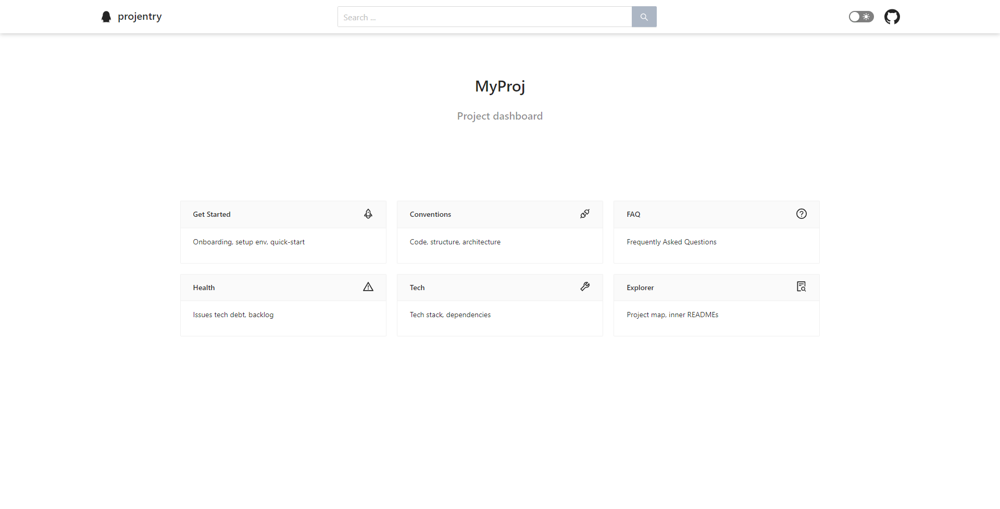
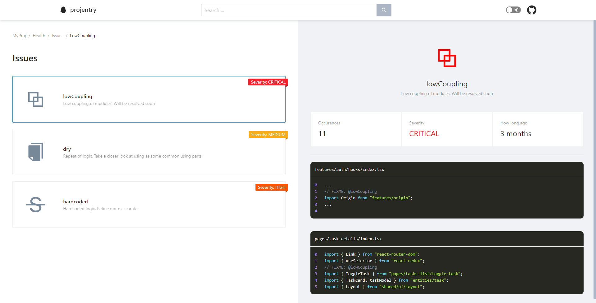
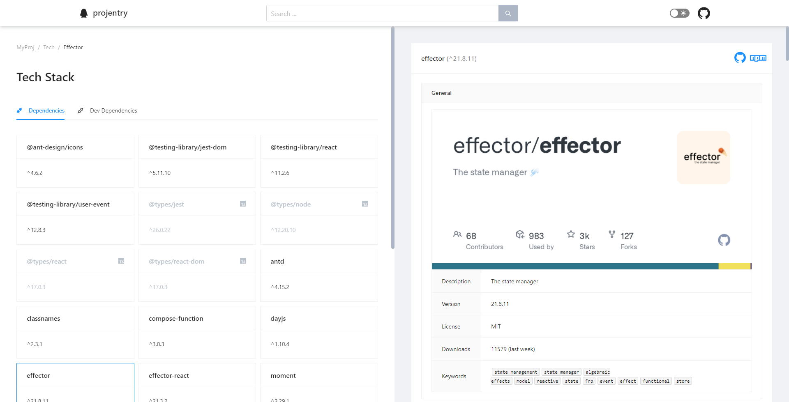
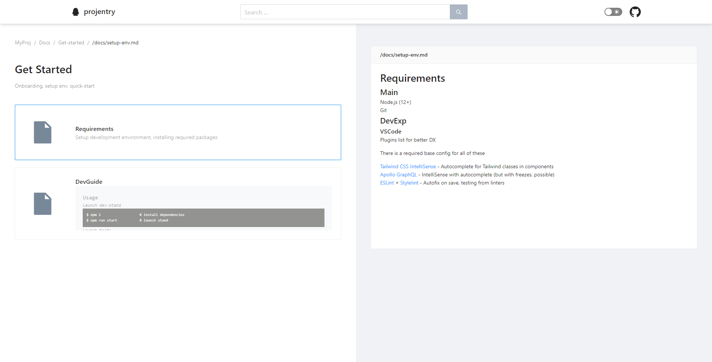

<!-- 🎯 Add external link for your solution (homepage, npm, ...) -->
# [Projentry](https://www.npmjs.com/package/@ani-team/projentry) [[Demo]](https://projentry.netlify.app/)

> `WIP:` For a while work in progress. Because of it - use this solution carefully
>
> More stable release would be after `v1.0.0`

<!-- 🏅 Add badges -->

[npm]: https://www.npmjs.com/package/@ani-team/projentry

[][npm]
[][npm]
[][npm]
[](https://hits.seeyoufarm.com)
<!-- [](https://github.com/ani-team/projentry/actions) -->

[](https://feature-sliced.design/)

<!-- 🖼️ Add logo / primary image -->


<!-- ⚡ Add primary information & features about your repository -->
Assistant for your project

<!-- Lorem ipsum [dolor sit amet](#), consectetur adipiscing elit, sed do eiusmod tempor *incididunt ut labore et dolore* -->

- UI Dashboard
- Code Driven Documentation
- Tech debt monitoring
- Project discovering
- Maintaining and refinements of project knowledges

<!-- (if needed) And primary note

> **Ex ea commodo consequat.**
> Duis aute irure dolor in reprehenderit in voluptate velit esse cillum dolore eu fugiat nulla pariatur. 
> - Excepteur sint occaecat [cupidatat](#) non 
> - Proident, sunt in culpa qui 
>
> Officia deserunt mollit anim id est laborum.

-->

<!-- (if needed) Add TOC

## Table of contents
* [Overview](#overview)
* [Get started](#get-started)
* [Usage](#usage)
* [Also](#also)

-->

## Motivation

There are a lot of typical problems of projects development

### Onboarding

It takes specific time before your new project teammate could be useful for development. Yet more time for own initiatives.

Also, onboarding of any colleagues require resources from old teammates - that little bit slows down project development.

### Fight with Legacy

Projects only get more complicated over time, and it becomes more difficult to monitor the quality of decisions made, compliance with the project conventions

### Live Doc

Difficult to keep project documentation up to date
Conventions, decisions made, concepts, backlog - it should all be quickly accessible

### Project health

Sometimes there are not enough linters and toolkits to monitor the "health and condition of the project" - specific for your code and conventions

Not general issues, that are resolved by any other solutions

We wanted toolkit, that helps us to measure our unique tech debt by our conventions!

## Overview

Our solution is UI Dashboard for:

- Grouping and navigating by hude docsbase
- Inspect and aggregate tech debt at one page
- Packages discovering with info learning

> Later will be available also:
> - our own lib usage
> - project scheme navigating
> - global search by docs
> - dark theme :D
> - and of course - more customizing of UI and lib logic!

<table>
    <tr>
        <td></td>
        <td></td>
    </tr>
    <tr>
        <td></td>
        <td></td>
    </tr>
</table>

## Get started
1. At first, install our npm package
    ```sh
    $ npm i @ani-team/projentry
    ```
2. Then, specify config in any [cosmicconfig](https://www.npmjs.com/package/cosmiconfig) format
    ```js
    // .projentryrc.js
    module.exports = {
        docs: {
            getStarted: {
                paths: [
                    "/docs/get-started.md",
                ],
            }
            conventions: {
                paths: [
                    "/pages/readme.md",
                    "/features/readme.md",
                ],
            },
        }
        issues: {
            visibleLinesDelta: 3,
            types: [
                {
                    tag: "lowCoupling",
                    description: "Low coupling of modules. Will be resolved soon",
                    severity: 4,
                },
                {
                    tag: "dry",
                    description: "Repeat of logic. Take a closer look at using as some common using parts",
                    severity: 2,
                },
            ]
        }
    }
    
    ```
3. And finally, specify and run projentry script for running dashboard
    ```js
    // package.json
    "scripts": {
        ...
        "projentry:start": "projentry"
    },
    ```
    ```sh
    $ npm run projentry:start
    ```
4. Profit! Now, any changes in your codebase, inner docs or config - would affect projentry dashboard

## Further Reading
<!-- - [FAQ](./FAQ.md) -->
- [Releases & Changelog](https://github.com/ani-team/projentry/releases)
- [**How can you help?**](./CONTRIBUTING.md)
  - ⭐ Rate us on GitHub
  - 💫 Have a look at our [contributing](./CONTRIBUTING.md) guide
    > **Everything is matter** - from *feedback* to *participating* in development!


